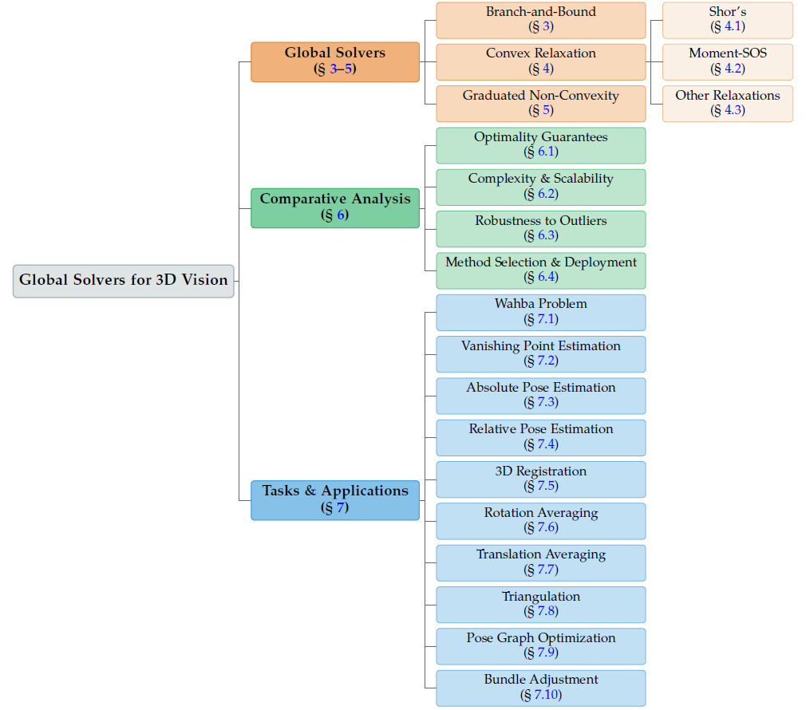
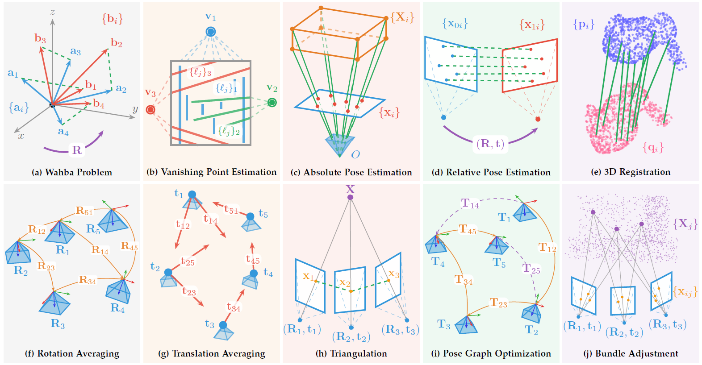

<div align="center">
  <h1><b> Awesome Global Solvers for 3D Vision </b></h1>
  <h3><b> Advances in Global Solvers for 3D Vision: A Comprehensive Survey </b></h3>
</div>

<div align="center">

<a href="https://ericzzj1989.github.io/"><strong>Zhenjun Zhao</strong></a><sup>1</sup>
&nbsp;&nbsp;
<a href="https://hankyang.seas.harvard.edu/"><strong>Heng Yang</strong></a><sup>2</sup>
&nbsp;&nbsp;
<a href="https://bangyan101.github.io/"><strong>Bangyan Liao</strong></a><sup>3</sup>
&nbsp;&nbsp;
<a href="https://www.linkedin.com/in/zengyingping/"><strong>Yingping Zeng</strong></a><sup>4</sup>
&nbsp;&nbsp;
<a href="https://laka-3dv.github.io/"><strong>Shaocheng Yan</strong></a><sup>5</sup>
<br>
<a href="https://github.com/Cyril-gyd"><strong>Yingdong Gu</strong></a><sup>5</sup>
&nbsp;&nbsp;
<a href="https://ethliup.github.io/"><strong>Peidong Liu</strong></a><sup>3</sup>
&nbsp;&nbsp;
<a href="https://sites.google.com/view/zhouyi-joey/home"><strong>Yi Zhou</strong></a><sup>4</sup>
&nbsp;&nbsp;
<a href="https://sites.google.com/view/haoangli/homepage"><strong>Haoang Li</strong></a><sup>6</sup>
&nbsp;&nbsp;
<a href="https://scholar.google.es/citations?user=j_sMzokAAAAJ&hl=en"><strong>Javier Civera</strong></a><sup>1</sup>

<br>

<sup>1</sup>University of Zaragoza &nbsp;&nbsp; <sup>2</sup>Harvard University &nbsp;&nbsp; <sup>3</sup>Westlake University &nbsp;&nbsp; <sup>4</sup>Hunan University &nbsp;&nbsp; <sup>5</sup>Wuhan University &nbsp;&nbsp; <sup>6</sup>HKUST(GZ)

</div>

<div align="center">

[](https://arxiv.org/abs/2602.14662)
[](https://github.com/ericzzj1989/Awesome-Global-Solvers-for-3D-Vision)

[](https://github.com/sindresorhus/awesome)
[](https://github.com/ericzzj1989/Awesome-Global-Solvers-for-3D-Vision)
[](http://makeapullrequest.com)

</div>

<br>

<p align="center">

</p>

**<p align="center"> Taxonomy of our survey on global solvers for 3D vision </p>**

---

> 🌟 If you find this repository useful, please consider giving it a **STAR ⭐** and **citing** our survey paper!
>
> 🙋 Please let us know if you find any mistakes or have suggestions! Feel free to open an [issue](https://github.com/ericzzj1989/Awesome-Global-Solvers-for-3D-Vision/issues) or submit a [pull request](https://github.com/ericzzj1989/Awesome-Global-Solvers-for-3D-Vision/blob/main/how-to-PR.md).

---

## 🏠 Introduction

This repository serves as a comprehensive resource hub accompanying our survey paper [*Advances in Global Solvers for 3D Vision*](https://arxiv.org/abs/2602.14662).

**Scope**: The survey systematically reviews global optimization methods across **3 major paradigms** and **10 fundamental 3D vision tasks**, covering **400+ papers** spanning from 1960 to 2025.

<table>
  <tr>
    <th>Paradigms</th>
    <th>Tasks</th>
  </tr>
  <tr>
    <td>🔹 <b>Branch-and-Bound (BnB)</b></td>
    <td rowspan="3">Wahba Problem · Vanishing Point Estimation<br>Absolute Pose Estimation · Relative Pose Estimation<br>3D Registration · Rotation Averaging<br> Translation Averaging · Triangulation<br>Pose Graph Optimization · Bundle Adjustment<br></td>
  </tr>
  <tr>
    <td>🔹 <b>Convex Relaxation</b> (Shor's / Moment-SOS / Others)</td>
  </tr>
  <tr>
    <td>🔹 <b>Graduated Non-Convexity (GNC)</b></td>
  </tr>
</table>

**What's included**:
- 📚 **Curated paper list**: Systematic organization of 250+ papers on global optimization methods for 3D vision
- 💻 **Companion tutorial code**: Hands-on examples demonstrating convex relaxation formulations using the [SPOT package](https://github.com/ComputationalRobotics/SPOT)
- 🎓 **Educational resources**: Workshops, tutorials, lectures, and talks from leading researchers

Please feel free to send us [pull requests](https://github.com/ericzzj1989/Awesome-Global-Solvers-for-3D-Vision/blob/main/how-to-PR.md) or [email](mailto:ericzzj89@gmail.com) to add papers, suggest improvements, or contribute resources!

---

## 🔥 News

- **[2025/02]** 📮 Our survey paper [*Advances in Global Solvers for 3D Vision*](https://arxiv.org/abs/2602.14662) is available on arXiv!
- **[2025/02]** 🚀 This repository is publicly released with 250+ curated papers and companion tutorial code.

<!-- - **[2025/XX]** 🎉 Our survey has been accepted by **IJRR**! -->

---

## 📝 Citation

If you find our survey helpful for your research, please consider citing:

```bibtex
@article{zhang2025advances,
  title={Advances in Global Solvers for 3D Vision},
  author={Zhao, Zhenjun and Heng, Yang and Liao, Bangyan and Zeng, Yingping and Yan, Shaocheng and Gu, Yingdong and Liu, Peidong and Zhou, Yi and Li, Haoang and Civera, Javier},
  journal={arXiv preprint arXiv:2602.14662},
  year={2025}
}
```

---

## 📖 Table of Contents

- [**Theory**](#theory)
  - [Branch-and-Bound (BnB)](#branch-and-bound-bnb)
  - [Shor's Relaxation](#shors-relaxation)
  - [Moment-SOS Relaxation](#moment-sos-relaxation)
  - [Other Relaxation Techniques](#other-relaxation-techniques)
  - [Graduated Non-Convexity (GNC)](#graduated-non-convexity-gnc)
  - [Consensus Maximization](#consensus-maximization)
- [**Application**](#application)
  - [Wahba Problem](#wahba-problem)
  - [Vanishing Point Estimation](#vanishing-point-estimation)
  - [Absolute Pose Estimation (PnP)](#absolute-pose-estimation-pnp)
  - [Relative Pose Estimation](#relative-pose-estimation)
  - [3D Registration](#3d-registration)
  - [Rotation Averaging](#rotation-averaging)
  - [Translation Averaging](#translation-averaging)
  - [Triangulation](#triangulation)
  - [Pose Graph Optimization](#pose-graph-optimization)
  - [Bundle Adjustment](#bundle-adjustment)
- [**Companion Tutorial Code**](#companion-tutorial-code)
- [**Other Resources**](#other-resources)
  - [Workshops](#workshops)
  - [Tutorials](#tutorials)
  - [Lectures](#lectures)
  - [Talks & Seminars](#talks--seminars)

---

## Theory

### Branch-and-Bound (BnB)

#### Foundational Papers

| Year | Venue | Paper | Links |
|:----:|:------|:------|:------|
| 1960 | Econometrica | An Automatic Method of Solving Discrete Programming Problems | [[Paper](https://jmvidal.cse.sc.edu/library/land60a.pdf)] |
| 1966 | Operations Research | Branch-and-Bound Methods: A Survey | [[Paper](https://pubsonline.informs.org/doi/abs/10.1287/opre.14.4.699)] |
| 1999 | - | Branch and Bound Algorithms-Principles and Examples | [[Paper](https://janders.eecg.toronto.edu/1387/readings/b_and_b.pdf)] |
| 2016 | Discrete Optimization | Branch-and-Bound Algorithms: A Survey of Recent Advances in Searching, Branching, and Pruning | [[Paper](https://www.sciencedirect.com/science/article/pii/S1572528616000062)] |
| 2019 | J. Global Optim. | A Generic Interval Branch and Bound Algorithm for Parameter Estimation | [[Paper](https://www.lirmm.fr/~trombetton/publis/bbestim_jogo_2018.pdf)] |

#### General Frameworks for Multiple Tasks

| Year | Venue | Paper | Links |
|:----:|:------|:------|:------|
| 2006 | ECCV | Practical Global Optimization for Multiview Geometry | [[Paper](https://homes.cs.washington.edu/~sagarwal/optimal.pdf)] |
| 2008 | IJCV | Practical Global Optimization for Multiview Geometry | [[Paper](https://homes.cs.washington.edu/~sagarwal/kahl-agarwal-etal-ijcv-07.pdf)] |
| 2009 | ICCV | Optimal Correspondences from Pairwise Constraints | [[Paper](https://lup.lub.lu.se/search/files/4311163/1454018.pdf)] |
| 2009 | IJCV | Global Optimization through Rotation Space Search | [[Paper](https://users.cecs.anu.edu.au/~hartley/Papers/PDF/HartleyKahl:Ematrix.pdf)] |
| 2009 | ICCV | Consensus Set Maximization with Guaranteed Global Optimality for Robust Geometry Estimation | [[Paper](https://users.cecs.anu.edu.au/~hongdong/iccv09.pdf)] |
| 2011 | CVPR | Deterministically Maximizing Feasible Subsystem for Robust Model Fitting with Unit Norm Constraint | [[Paper](http://www.cvpapers.com/papers/1494.pdf)] |
| 2022 | IJCV | Globally Optimal Linear Model Fitting with Unit-Norm Constraint | [[Paper](https://link.springer.com/article/10.1007/s11263-022-01574-z)] |
| 2024 | TPAMI | Accelerating Globally Optimal Consensus Maximization in Geometric Vision | [[Paper](https://arxiv.org/pdf/2304.05156)] |

### Shor's Relaxation

#### Foundational Papers

| Year | Venue | Paper | Links |
|:----:|:------|:------|:------|
| 2000 | Handbook of SDP | Semidefinite Programming Relaxations of Nonconvex Quadratic Optimization | [[Paper](https://www.math.uwaterloo.ca/~hwolkowi/henry/reports/chapqqps.pdf)] |
| 2003 | Math. Programming | A Nonlinear Programming Algorithm for Solving Semidefinite Programs via Low-rank Factorization | [[Paper](https://sburer.github.io/papers/007-lowrank.pdf)] |
| 2006 | SIAM J. Optim. | Exploiting Sparsity in Semidefinite Programming via Matrix Completion I: General Framework | [[Paper](https://pages.cs.wisc.edu/~nathanae/nonlinproj/fukada.pdf)] |
| 2010 | Signal Process. Mag. | Semidefinite Relaxation of Quadratic Optimization Problems | [[Paper](https://www1.se.cuhk.edu.hk/~manchoso/papers/sdrapp-SPM.pdf)] |
| 2012 | Math. Programming | On Convex Relaxations for Quadratically Constrained Quadratic Programming | [[Paper](https://optimization-online.org/wp-content/uploads/2010/08/2699.pdf)] |
| 2015 | Math. Program. Comput. | SDPNAL+: A Majorized Semismooth Newton-CG Augmented Lagrangian Method for SDP with Nonnegative Constraints | [[Paper](https://arxiv.org/pdf/1406.0942)] |
| 2016 | NeurIPS | The Non-Convex Burer-Monteiro Approach Works on Smooth Semidefinite Programs | [[Paper](https://arxiv.org/pdf/1606.04970)] |
| 2018 | Found. Comput. Math. | Random Laplacian Matrices and Convex Relaxations | [[Paper](https://arxiv.org/pdf/1504.03987)] |
| 2019 | arXiv | Block-Coordinate Minimization for Large SDPs with Block-Diagonal Constraints | [[Paper](https://arxiv.org/pdf/1903.00597)] |
| 2020 | WAFR | Scalable Low-Rank Semidefinite Programming for Certifiably Correct Machine Perception | [[Paper](https://link.springer.com/chapter/10.1007/978-3-030-66723-8_33)] |
| 2022 | Math. Programming | On the Local Stability of Semidefinite Relaxations | [[Paper](https://arxiv.org/pdf/1710.04287)] |
| 2022 | RAL | Accelerating Certifiable Estimation with Preconditioned Eigensolvers | [[Paper](https://arxiv.org/pdf/2207.05257)] |
| 2024 | RSS Workshop | An Overview of the Burer-Monteiro Method for Certifiable Robot Perception | [[Paper](https://arxiv.org/pdf/2410.00117)] |
| 2024 | TRO | Toward Globally Optimal State Estimation Using Automatically Tightened Semidefinite Relaxations | [[Paper](https://arxiv.org/pdf/2308.05783)] [[Code](https://github.com/utiasASRL/constraint_learning)] |
| 2024 | WAFR | Exploiting Chordal Sparsity for Fast Global Optimality with Application to Localization | [[Paper](https://arxiv.org/pdf/2406.02365)] |
| 2024 | ICML | Fast, Scalable, Warm-Start Semidefinite Programming with Spectral Bundling and Sketching | [[Paper](https://arxiv.org/pdf/2312.11801)] [[Code](https://github.com/rangell/usbs)] |

#### General Frameworks for Multiple Tasks

| Year | Venue | Paper | Links |
|:----:|:------|:------|:------|
| 2022 | JMIV | On the Tightness of Semidefinite Relaxations for Rotation Estimation | [[Paper](https://arxiv.org/pdf/2101.02099)] |
| 2024 | TRO | On Semidefinite Relaxations for Matrix-Weighted State-Estimation Problems in Robotics | [[Paper](https://arxiv.org/pdf/2308.07275)] |

### Moment-SOS Relaxation

#### Foundational Papers

| Year | Venue | Paper | Links |
|:----:|:------|:------|:------|
| 2001 | SIAM J. Optim. | Global Optimization with Polynomials and the Problem of Moments | [[Paper](https://www.researchgate.net/profile/Jean-Bernard-Lasserre/publication/2616595_Global_Optimization_With_Polynomials_And_The_Problem_Of_Moments/links/00b4951a5d937799ce000000/Global-Optimization-With-Polynomials-And-The-Problem-Of-Moments.pdf)] |
| 2003 | Math. Programming | Semidefinite Programming Relaxations for Semialgebraic Problems | [[Paper](https://www.mit.edu/~parrilo/pubs/files/SDPrelaxations.pdf)] |
| 2006 | SIAM J. Optim. | Convergent SDP-Relaxations in Polynomial Optimization with Sparsity | [[Paper](https://www.researchgate.net/profile/Jean-Bernard-Lasserre/publication/221333756_Convergent_SDP-Relaxations_in_Polynomial_Optimization_with_Sparsity/links/00b4951a3bedde534e000000/Convergent-SDP-Relaxations-in-Polynomial-Optimization-with-Sparsity.pdf)] |
| 2008 | Emerging App. Alg. Geom. | Sums of Squares, Moment Matrices and Optimization Over Polynomials | [[Paper](https://homepages.cwi.nl/~monique/files/moment-ima-update-new.pdf)] |
| 2010 | APJOR | SDP Relaxations for Quadratic Optimization Problems Derived from Polynomial Optimization Problems | [[Paper](https://s3.us.cloud-object-storage.appdomain.cloud/res-files/1885-MKqop.pdf)] |
| 2014 | Math. Programming | Optimality Conditions and Finite Convergence of Lasserre's Hierarchy | [[Paper](https://arxiv.org/pdf/1206.0319)] |
| 2022 | OL | Convergence of Lasserre's hierarchy: the general case | [[Paper](https://arxiv.org/pdf/2011.08139)] |
| 2025 | Math. Programming | Finding Global Minima via Kernel Approximations | [[Paper](https://arxiv.org/pdf/2012.11978)] |

#### General Frameworks for Multiple Tasks

| Year | Venue | Paper | Links |
|:----:|:------|:------|:------|
| 2005 | ICCV | Globally Optimal Estimates for Geometric Reconstruction Problems | [[Paper](https://vision.cornell.edu/se3/wp-content/uploads/2014/09/iccv05a.pdf)] |
| 2007 | IJCV | Globally Optimal Estimates for Geometric Reconstruction Problems | [[Paper](https://www.cs.ait.ac.th/~mdailey/cvreadings/Kahl-Global.pdf)] |
| 2019 | ICCV | Convex Relaxations for Consensus and Non-Minimal Problems in 3D Vision | [[Paper](https://arxiv.org/pdf/1909.12034)] |
| 2020 | NeurIPS | One Ring to Rule Them All: Certifiably Robust Geometric Perception with Outliers | [[Paper](https://arxiv.org/pdf/2006.06769)] [[Code](https://github.com/MIT-SPARK/CertifiablyRobustPerception/tree/NeurIPS2020)] |
| 2022 | TPAMI | Certifiably Optimal Outlier-Robust Geometric Perception: Semidefinite Relaxations and Scalable Global Optimization | [[Paper](https://arxiv.org/pdf/2109.03349)] [[Code](https://github.com/MIT-SPARK/CertifiablyRobustPerception)] |

### Other Relaxation Techniques

| Year | Venue | Paper | Links |
|:----:|:------|:------|:------|
| 2004 | CVPR | $L_\infty$ Minimization in Geometric Reconstruction Problems | [[Paper](https://www.robots.ox.ac.uk/~vgg/publications/2004/Hartley04b/hartley04b.pdf)] |
| 2005 | ICCV | Multiple View Geometry and the $L_\infty$-Norm | [[Paper](https://citeseerx.ist.psu.edu/document?repid=rep1&type=pdf&doi=4709597f006ce58ee07043c7d140b8bb93df890f)] |
| 2006 | CVPR | Removing Outliers Using the $L_\infty$ Norm | [[Paper](https://ieeexplore.ieee.org/document/1640796)] |
| 2007 | ICCV | Efficient Optimization for $L_\infty$-problems Using Pseudoconvexity | [[Paper](https://ieeexplore.ieee.org/document/4409087)] |
| 2007 | ICCV | A Fast Method to Minimize $L_\infty$ Error Norm for Geometric Vision Problems | [[Paper](https://ieeexplore.ieee.org/document/4408913)] |
| 2007 | TPAMI | Quasiconvex Optimization for Robust Geometric Reconstruction | [[Paper](https://www.cs.cmu.edu/~ke/publications/quasiconvex-optimization-PAMI.pdf)] |
| 2008 | CVPR | Fast Algorithms for $L_\infty$ Problems in Multiview Geometry | [[Paper](https://homes.cs.washington.edu/~sagarwal/gfp.pdf)] |
| 2008 | CVPR | A Polynomial-time Bound for Matching and Registration with Outliers | [[Paper](https://scispace.com/pdf/a-polynomial-time-bound-for-matching-and-registration-with-mpk50t5i0e.pdf)] |
| 2008 | TPAMI | Multiple-View Geometry Under the $L_\infty$-Norm | [[Paper](https://ieeexplore.ieee.org/stamp/stamp.jsp?arnumber=4385722)] |
| 2009 | CVPR | Efficient Reduction of L-infinity Geometry Problems | [[Paper](https://users.cecs.anu.edu.au/~hongdong/1289.pdf)] |
| 2010 | CVPR | Outlier Removal Using Duality | [[Paper](http://aeriksson.net/papers/olsson-eriksson-etal-cvpr-10.pdf)] [[Code](https://www.maths.lth.se/matematiklth/personal/calle/Outl_dual/Outl_dual.html)] |
| 2017 | CVPR | Consensus Maximization with Linear Matrix Inequality Constraints | [[Paper](https://openaccess.thecvf.com/content_cvpr_2017/papers/Speciale_Consensus_Maximization_With_CVPR_2017_paper.pdf)] |
| 2024 | RAL | FracGM: A Fast Fractional Programming Technique for Geman-McClure Robust Estimator | [[Paper](https://arxiv.org/pdf/2409.13978)] [[Code](https://github.com/StephLin/FracGM)] |

### Graduated Non-Convexity (GNC)

| Year | Venue | Paper | Links |
|:----:|:------|:------|:------|
| 1996 | IJCV | On the Unification Line Processes, Outlier Rejection, and Robust Statistics with Applications in Early Vision | [[Paper](https://www.cise.ufl.edu/~anand/pdf/ijcv.pdf)] |
| 2015 | CVPRW | On the Link between Gaussian Homotopy Continuation and Convex Envelopes | [[Paper](https://people.csail.mit.edu/hmobahi/pubs/gaussian_convenv_2015.pdf)] |
| 2020 | RAL | Graduated Non-Convexity for Robust Spatial Perception: From Non-Minimal Solvers to Global Outlier Rejection | [[Paper](https://arxiv.org/pdf/1909.08605)] [[Code](https://github.com/MIT-SPARK/GNC-and-ADAPT)] |
| 2023 | CVPR | Adaptive Annealing for Robust Geometric Estimation | [[Paper](https://openaccess.thecvf.com/content/CVPR2023/papers/Sidhartha_Adaptive_Annealing_for_Robust_Geometric_Estimation_CVPR_2023_paper.pdf)] |
| 2024 | ECCV | Adaptive Annealing for Robust Averaging | [[Paper](https://www.ecva.net/papers/eccv_2024/papers_ECCV/papers/08834.pdf)] |

#### Robust Variants: Adaptive Trimming (ADAPT)

| Year | Venue | Paper | Links |
|:----:|:------|:------|:------|
| 2019 | IROS | Outlier-Robust Spatial Perception: Hardness, General-Purpose Algorithms, and Guarantees | [[Paper](https://arxiv.org/pdf/1903.11683)] |
| 2021 | TRO | Outlier-Robust Estimation: Hardness, Minimally Tuned Algorithms, and Applications | [[Paper](https://arxiv.org/pdf/2007.15109)] [[Code](https://github.com/MIT-SPARK/GNC-and-ADAPT)] |

### Consensus Maximization

| Year | Venue | Paper | Links |
|:----:|:------|:------|:------|
| 2015 | CVPR | Efficient Globally Optimal Consensus Maximisation with Tree Search | [[Paper](https://openaccess.thecvf.com/content_cvpr_2015/papers/Chin_Efficient_Globally_Optimal_2015_CVPR_paper.pdf)] |
| 2018 | ECCV | Robust Fitting in Computer Vision: Easy or Hard? | [[Paper](https://arxiv.org/pdf/1802.06464)] |
| 2018 | ECCV | Deterministic Consensus Maximization with Biconvex Programming | [[Paper](https://arxiv.org/pdf/1807.09436)] [[Code](https://github.com/ZhipengCai/Demo---Deterministic-consensus-maximization-with-biconvex-programming)] |
| 2019 | ICCV | Consensus Maximization Tree Search Revisited | [[Paper](https://arxiv.org/pdf/1908.02021)] [[Code](https://github.com/ZhipengCai/MaxConTreeSearch)] |
| 2019 | TPAMI | Deterministic Approximate Methods for Maximum Consensus Robust Fitting | [[Paper](https://arxiv.org/pdf/1710.10003)] |
| 2019 | TRO | Efficient Algorithms for Maximum Consensus Robust Fitting | [[Paper](https://ieeexplore.ieee.org/stamp/stamp.jsp?arnumber=8870243)] |

---

## Application

<p align="center">

</p>

**<p align="center"> Geometric illustration of the 10 fundamental 3D vision tasks covered in our survey </p>**

### Wahba Problem

#### BnB for Wahba Problem

| Year | Venue | Paper | Links |
|:----:|:------|:------|:------|
| 2012 | ACCV | Globally Optimal Consensus Set Maximization through Rotation Search | [[Paper](https://d1wqtxts1xzle7.cloudfront.net/84933662/ACCV_2012-libre.pdf)] |
| 2014 | CVPR | Fast Rotation Search with Stereographic Projections for 3D Registration | [[Paper](https://openaccess.thecvf.com/content_cvpr_2014/papers/Bustos_Fast_Rotation_Search_2014_CVPR_paper.pdf)] |
| 2016 | TPAMI | Fast Rotation Search with Stereographic Projections for 3D Registration | [[Paper](https://ieeexplore.ieee.org/document/7381673)] |

#### Shor's Relaxation for Wahba Problem

| Year | Venue | Paper | Links |
|:----:|:------|:------|:------|
| 2011 | CDC | Semidefinite Relaxation of a Robust Static Attitude Determination Problem | [[Paper](https://skoge.folk.ntnu.no/prost/proceedings/cdc-ecc-2011/data/papers/0926.pdf)] |
| 2012 | TSP | A Semidefinite Relaxation-Based Algorithm for Robust Attitude Estimation | [[Paper](https://spiral.imperial.ac.uk/server/api/core/bitstreams/69456b59-58b5-470a-9352-22321a0b02f4/content)] |
| 2016 | TOG | Point Registration via Efficient Convex Relaxation | [[Paper](https://haggaim.github.io/projects/point_registration/PMSDP_final_light.pdf)] [[Code](https://github.com/Haggaim/PM-SDP)] |
| 2017 | SIAM J. Optim. | Exact Recovery with Symmetries for Procrustes Matching | [[Paper](https://arxiv.org/pdf/1606.01548)] |
| 2019 | ICCV | A Quaternion-based Certifiably Optimal Solution to the Wahba Problem with Outliers | [[Paper](https://arxiv.org/pdf/1905.12536)] |
| 2021 | arXiv | Near-Optimal Bounds for Generalized Orthogonal Procrustes Problem via Generalized Power Method | [[Paper](https://arxiv.org/pdf/2112.13725)] |
| 2022 | ECCV | Semidefinite Relaxations of Truncated Least-Squares in Robust Rotation Search: Tight or Not | [[Paper](https://www.ecva.net/papers/eccv_2022/papers_ECCV/papers/136830655.pdf)] |
| 2022 | arXiv | Towards Understanding The Semidefinite Relaxations of Truncated Least-Squares in Robust Rotation Search | [[Paper](https://arxiv.org/pdf/2207.08350)] |

#### Other Relaxation for Wahba Problem

| Year | Venue | Paper | Links |
|:----:|:------|:------|:------|
| 2014 | arXiv | Semidefinite Descriptions of the Convex Hull of Rotation Matrices | [[Paper](https://arxiv.org/pdf/1403.4914)] |
| 2015 | J. Guid. Control Dyn. | Linear-Matrix-Inequality-Based Solution to Wahba's Problem | [[Paper](https://deepblue.lib.umich.edu/bitstream/handle/2027.42/140644/1.g000132.pdf)] |

#### Robust Preprocessing

| Year | Venue | Paper | Links |
|:----:|:------|:------|:------|
| 2015 | ICCV | Guaranteed Outlier Removal for Rotation Search | [[Paper](https://openaccess.thecvf.com/content_iccv_2015/papers/Bustos_Guaranteed_Outlier_Removal_ICCV_2015_paper.pdf)] |
| 2022 | CVPR | ARCS: Accurate Rotation and Correspondence Search | [[Paper](https://arxiv.org/pdf/2203.14493)] [[Code](https://github.com/liangzu/ARCS)] |

### Vanishing Point Estimation

#### BnB for Vanishing Point Estimation

| Year | Venue | Paper | Links |
|:----:|:------|:------|:------|
| 2012 | CVPR | Globally Optimal Line Clustering and Vanishing Point Estimation in Manhattan World | [[Paper](https://people.inf.ethz.ch/pomarc/pubs/BazinCVPR12.pdf)] |
| 2016 | CVPR | Globally Optimal Manhattan Frame Estimation in Real-time | [[Paper](https://openaccess.thecvf.com/content_cvpr_2016/papers/Joo_Globally_Optimal_Manhattan_CVPR_2016_paper.pdf)] |
| 2018 | TPAMI | Robust and Globally Optimal Manhattan Frame Estimation in Near Real Time | [[Paper](https://arxiv.org/pdf/1605.03730)] |
| 2018 | CVPR | Globally Optimal Inlier Set Maximization for Atlanta Frame Estimation | [[Paper](https://openaccess.thecvf.com/content_cvpr_2018/papers/Joo_Globally_Optimal_Inlier_CVPR_2018_paper.pdf)] |
| 2019 | TPAMI | Globally Optimal Inlier Set Maximization for Atlanta World Understanding | [[Paper](https://ieeexplore.ieee.org/document/8684265)] |
| 2019 | ICCV | Quasi-globally Optimal and Efficient Vanishing Point Estimation in Manhattan World | [[Paper](https://openaccess.thecvf.com/content_ICCV_2019/papers/Li_Quasi-Globally_Optimal_and_Efficient_Vanishing_Point_Estimation_in_Manhattan_World_ICCV_2019_paper.pdf)] |
| 2020 | ECCV | Globally Optimal and Efficient Vanishing Point Estimation in Atlanta World | [[Paper](https://www.ecva.net/papers/eccv_2020/papers_ECCV/papers/123670154.pdf)] |
| 2020 | TPAMI | Globally Optimal Vertical Direction Estimation in Atlanta World | [[Paper](https://mediatum.ub.tum.de/doc/1575108/sbpjj4tkp2hgx5o95u2wotkzw.GlobalVerticallyCorrect.pdf)] [[Code](https://github.com/Liu-Yinlong/Globally-optimal-vertical-direction-estimation-in-Atlanta-world)] |
| 2022 | TPAMI | Quasi-globally Optimal and Near/True Real-time Vanishing Point Estimation in Manhattan World | [[Paper](https://ieeexplore.ieee.org/document/9193899)] |

#### Shor's Relaxation for Vanishing Point Estimation

| Year | Venue | Paper | Links |
|:----:|:------|:------|:------|
| 2025 | CVPR | Convex Relaxation for Robust Vanishing Point Estimation in Manhattan World | [[Paper](https://arxiv.org/pdf/2505.04788)] [[Code](https://github.com/WU-CVGL/GlobustVP/)] |

### Absolute Pose Estimation (PnP)

#### BnB for PnP

| Year | Venue | Paper | Links |
|:----:|:------|:------|:------|
| 2006 | ICPR | Optimal Estimation of Perspective Camera Pose | [[Paper](https://ieeexplore.ieee.org/document/1699135)] |
| 2008 | ECCV | Robust Optimal Pose Estimation | [[Paper](https://link.springer.com/chapter/10.1007/978-3-540-88682-2_12)] |
| 2010 | WCICA | Linear Relaxation for Global Pose Estimation | [[Paper](https://ieeexplore.ieee.org/document/5554370)] |
| 2015 | ICCV | Globally Optimal 2D-3D Registration from Points or Lines Without Correspondences | [[Paper](https://openaccess.thecvf.com/content_iccv_2015/papers/Brown_Globally_Optimal_2D-3D_ICCV_2015_paper.pdf)] |
| 2017 | ICCV | Globally-Optimal Inlier Set Maximisation for Simultaneous Camera Pose and Feature Correspondence | [[Paper](https://arxiv.org/pdf/1709.09384)] |
| 2018 | TPAMI | Globally-Optimal Inlier Set Maximisation for Camera Pose and Correspondence Estimation | [[Paper](https://ieeexplore.ieee.org/document/8388302)] |
| 2018 | TIP | 2D-3D Point Set Registration Based on Global Rotation Search | [[Paper](https://ieeexplore.ieee.org/stamp/stamp.jsp?arnumber=8579206)] |
| 2019 | CVPR | The Alignment of the Spheres: Globally-Optimal Spherical Mixture Alignment for Camera Pose Estimation | [[Paper](https://arxiv.org/pdf/1812.01232)] |
| 2019 | PR | A Family of Globally Optimal Branch-and-Bound Algorithms for 2D-3D Correspondence-Free Registration | [[Paper](https://www.sciencedirect.com/science/article/pii/S0031320319301426)] |
| 2019 | Remote Sensing | A Novel Method for the Absolute Pose Problem with Pairwise Constraints | [[Paper](https://arxiv.org/pdf/1903.10175)] |
| 2020 | RAL | Globally Optimal Camera Orientation Estimation from Line Correspondences by BnB algorithm | [[Paper](https://mediatum.ub.tum.de/doc/1578987/d940lkg94pulffrppfh5kvequ.pdf)] |
| 2021 | TPAMI | Efficient and Outlier-Robust Simultaneous Pose and Correspondence Determination by BnB and Transformation Decomposition | [[Paper](https://ieeexplore.ieee.org/document/9485090)] |
| 2023 | TCSVT | Absolute Pose Estimation With a Known Direction by Motion Decoupling | [[Paper](https://ieeexplore.ieee.org/document/10093787)] [[Code](https://github.com/Liu-Yinlong/algorithm-for-PnP-with-known-vertical-direction)] |
| 2024 | RAL | Efficient and Globally Optimal Camera Orientation Estimation With Line Correspondences | [[Paper](https://ieeexplore.ieee.org/document/10702548)] [[Code](https://github.com/tyhuang98/EGO_PnL)] |
| 2025 | RAL | BnB-Based Robust PnP Pose Estimation Method for Outliers | [[Paper](https://ieeexplore.ieee.org/document/11011668)] |

#### Shor's Relaxation for PnP

| Year | Venue | Paper | Links |
|:----:|:------|:------|:------|
| 2010 | Image Vis. Comput. | Optimal Non-Iterative Pose Estimation via Convex Relaxation | [[Paper](https://www.sciencedirect.com/science/article/pii/S0262885610000442)] |
| 2023 | JMIV | CvxPnPL: A Unified Convex Solution to the Absolute Pose Estimation Problem from Point and Line Correspondences | [[Paper](https://arxiv.org/pdf/1907.10545)] [[Code](https://github.com/SergioRAgostinho/cvxpnpl)] |

#### Moment-SOS Relaxation for PnP

| Year | Venue | Paper | Links |
|:----:|:------|:------|:------|
| 2008 | BMVC | Globally Optimal O(n) Solution to the PnP Problem for General Camera Models | [[Paper](https://bmva-archive.org.uk/bmvc/2008/papers/31.pdf)] |
| 2020 | Access | Certifiably Optimal and Robust Camera Pose Estimation From Points and Lines | [[Paper](https://ieeexplore.ieee.org/document/9129691)] |
| 2021 | Sensors | The Non-Tightness of a Convex Relaxation to Rotation Recovery | [[Paper](https://pdfs.semanticscholar.org/8443/078e59470deca8fabcb50b5294093e294cb5.pdf)] |

#### Other Relaxation for PnP

| Year | Venue | Paper | Links |
|:----:|:------|:------|:------|
| 2014 | ICRA | Convex Relaxations of SE(2) and SE(3) for Visual Pose Estimation | [[Paper](https://arxiv.org/pdf/1401.3700)] |
| 2016 | TIP | Non-Iterative Rigid 2D/3D Point-Set Registration Using Semidefinite Programming | [[Paper](https://arxiv.org/pdf/1501.00630)] |
| 2020 | ECCV | A Consistently Fast and Globally Optimal Solution to the Perspective-n-Point Problem | [[Paper](https://www.ecva.net/papers/eccv_2020/papers_ECCV/papers/123460460.pdf)] [[Code](https://github.com/terzakig/sqpnp)] |
| 2023 | RAL | Efficient Solution to PnP Problem Based on Vision Geometry | [[Paper](https://ieeexplore.ieee.org/document/10319768)] |
| 2024 | SIAM J. Imaging Sci. | Fast Certifiable Algorithm for the Absolute Pose Estimation of a Camera | [[Paper](https://mapir.isa.uma.es/papersrepo/2024/mergarsal_cert_pnp.pdf)] |

#### GNC for PnP

| Year | Venue | Paper | Links |
|:----:|:------|:------|:------|
| 2020 | Access | Certifiably Optimal and Robust Camera Pose Estimation From Points and Lines | [[Paper](https://ieeexplore.ieee.org/document/9129691)] |
| 2024 | IET CV | Outliers Rejection for Robust Camera Pose Estimation using Graduated Non-Convexity | [[Paper](https://ietresearch.onlinelibrary.wiley.com/doi/pdfdirect/10.1049/cvi2.12330)] |

### Relative Pose Estimation

#### BnB for Relative Pose Estimation

| Year | Venue | Paper | Links |
|:----:|:------|:------|:------|
| 2007 | ICCV | Global Optimization through Searching Rotation Space and Optimal Estimation of the Essential Matrix | [[Paper](https://ieeexplore.ieee.org/document/4408896)] |
| 2008 | CVPR | Motion Estimation for Multi-Camera Systems using Global Optimization | [[Paper](https://users.cecs.anu.edu.au/~hartley/Papers/PDF/KimLiHartley:CVPR08.pdf)] |
| 2009 | BMVC | Two View Geometry Estimation with Outliers | [[Paper](https://bmva-archive.org.uk/bmvc/2009/Papers/Paper431/Paper431.pdf)] |
| 2009 | ICCV | Globally Optimal Affine Epipolar Geometry from Apparent Contours | [[Paper](https://ieeexplore.ieee.org/document/5459147)] |
| 2009 | TPAMI | Motion Estimation for Nonoverlapping Multicamera Rigs: Linear Algebraic and $L_\infty$ Geometric Solutions | [[Paper](https://users.cecs.anu.edu.au/~jaehak/paper/Kim_et_al_TPAMI2010.pdf)] |
| 2011 | CVPR | A Branch and Contract Algorithm for Globally Optimal Fundamental Matrix Estimation | [[Paper](https://ieeexplore.ieee.org/document/5995352)] |
| 2013 | ICCV | Direct Optimization of Frame-to-Frame Rotation | [[Paper](https://openaccess.thecvf.com/content_iccv_2013/papers/Kneip_Direct_Optimization_of_2013_ICCV_paper.pdf)] |
| 2014 | ECCV | Optimal Essential Matrix Estimation via Inlier-Set Maximization | [[Paper](https://jlyang.org/eccv14_optimalematrix.pdf)] |
| 2014 | ECCV | Globally Optimal Inlier Set Maximization With Unknown Rotation and Focal Length | [[Paper](https://people.inf.ethz.ch/pomarc/pubs/BazinECCV14.pdf)] |
| 2015 | CVPR | Practical Robust Two-View Translation Estimation | [[Paper](https://openaccess.thecvf.com/content_cvpr_2015/papers/Fredriksson_Practical_Robust_Two-View_2015_CVPR_paper.pdf)] |
| 2016 | CVPR | Optimal Relative Pose with Unknown Correspondences | [[Paper](https://openaccess.thecvf.com/content_cvpr_2016/papers/Fredriksson_Optimal_Relative_Pose_CVPR_2016_paper.pdf)] |
| 2020 | ICRA | Efficient Globally-Optimal Correspondence-Less Visual Odometry for Planar Ground Vehicles | [[Paper](https://arxiv.org/pdf/2203.00291)] |
| 2020 | ICRA | Globally Optimal Relative Pose Estimation for Camera on a Selfie Stick | [[Paper](https://ieeexplore.ieee.org/document/9196921)] |
| 2021 | RAL | Globally Optimal Consensus Maximization for Relative Pose Estimation With Known Gravity Direction | [[Paper](https://mediatum.ub.tum.de/doc/1613526/fwd04tq7nzvuegw23cpsnrcq5.pdf)] [[Code](https://github.com/Liu-Yinlong/Globally-Optimal-Consensus-Maximization-for-Relative-Pose-Estimation-with-Known-Gravity-Direction)] |
| 2022 | Front. Neurorobot. | Globally-Optimal Inlier Maximization for Relative Pose Estimation Under Planar Motion | [[Paper](https://mediatum.ub.tum.de/doc/1649876/ldzwfew4eb3e2m1r71ktg6szj.fnbot-16-820703.pdf)] |

#### Shor's Relaxation for Relative Pose Estimation

| Year | Venue | Paper | Links |
|:----:|:------|:------|:------|
| 2018 | CVPR | A Certifiably Globally Optimal Solution to the Non-Minimal Relative Pose Problem | [[Paper](https://openaccess.thecvf.com/content_cvpr_2018/CameraReady/3968.pdf)] |
| 2020 | CVPR | A Certifiably Globally Optimal Solution to Generalized Essential Matrix Estimation | [[Paper](https://openaccess.thecvf.com/content_CVPR_2020/papers/Zhao_A_Certifiably_Globally_Optimal_Solution_to_Generalized_Essential_Matrix_Estimation_CVPR_2020_paper.pdf)] |
| 2020 | IROS | Robot-to-Robot Relative Pose Estimation based on Semidefinite Relaxation Optimization | [[Paper](https://freeformrobotics.org/wp-content/uploads/2022/02/IROS20_0234_FI.pdf)] |
| 2021 | IVC | Certifiable Relative Pose Estimation | [[Paper](https://arxiv.org/pdf/2003.13732)] |
| 2021 | JMIV | Fast and Robust Certifiable Estimation of the Relative Pose Between Two Calibrated Cameras | [[Paper](https://arxiv.org/pdf/2101.08524)] [[Code](https://github.com/mergarsal/FastCertRelPose)] |
| 2022 | TPAMI | An Efficient Solution to Non-Minimal Case Essential Matrix Estimation | [[Paper](https://arxiv.org/pdf/1903.09067)] [[Code](https://github.com/jizhaox/npt-pose)] |
| 2022 | JMIV | A Tighter Relaxation for the Relative Pose Problem Between Cameras | [[Paper](https://mapir.isa.uma.es/papersrepo/2022/2022_mercedes_JMIV_tighter_rel_rpp_paper.pdf)] [[Code](https://github.com/mergarsal/TighterRPp)] |
| 2023 | ICCV | Essential Matrix Estimation using Convex Relaxations in Orthogonal Space | [[Paper](https://openaccess.thecvf.com/content/ICCV2023/papers/Karimian_Essential_Matrix_Estimation_using_Convex_Relaxations_in_Orthogonal_Space_ICCV_2023_paper.pdf)] [[Code](https://github.com/armandok/QME)] |
| 2023 | - | Fast Certifiable Relative Pose Estimation with Gravity Prior | [[Paper](https://mapir.isa.uma.es/papersrepo/2023/2023_mercedes_AI_priorRPp_doc.pdf)] [[Code](https://github.com/mergarsal/RedCertRPpPrior)] |
| 2024 | CVPR | From Correspondences to Pose: Non-minimal Certifiably Optimal Relative Pose without Disambiguation | [[Paper](https://arxiv.org/pdf/2312.05995)] [[Code](https://github.com/javrtg/C2P)] [[Project](https://javrtg.github.io/C2P/)] |
| 2024 | CVIU | Certifiable Planar Relative Pose Estimation with Gravity Prior | [[Paper](https://mapir.isa.uma.es/papersrepo/2024/mergarsal_cert_rpp_planar_prior.pdf)] [[Code](https://github.com/mergarsal/RedCertRPpPrior)] |

#### Moment-SOS Relaxation for Relative Pose Estimation

| Year | Venue | Paper | Links |
|:----:|:------|:------|:------|
| 2002 | TPAMI | Estimating the Fundamental Matrix via Constrained Least-Squares: A Convex Approach | [[Paper](https://mi.eng.cam.ac.uk/~cipolla/publications/article/2002-PAMI-fundamental.pdf)] |
| 2009 | TPAMI | Camera Displacement via Constrained Minimization of the Algebraic Error | [[Paper](https://ieeexplore.ieee.org/abstract/document/4731224)] |
| 2010 | ICCASM | New Fundamental Matrix Estimation Method Using Global Optimization | [[Paper](https://ieeexplore.ieee.org/document/5620116)] |
| 2015 | JMIV | Rank-Constrained Fundamental Matrix Estimation by Polynomial Global Optimization Versus the Eight-Point Algorithm | [[Paper](https://arxiv.org/pdf/1403.4806)] |
| 2015 | CVPR | A Convex Optimization Approach to Robust Fundamental Matrix Estimation | [[Paper](https://openaccess.thecvf.com/content_cvpr_2015/papers/Cheng_A_Convex_Optimization_2015_CVPR_paper.pdf)] |
| 2019 | AIAM | Non-Minimum Essential Matrix Estimation Using Sum of Square Method | [[Paper](https://ieeexplore.ieee.org/abstract/document/8950797)] |
| 2022 | JIN | SPLP: A Certifiably Globally Optimal Solution to the Relative Pose Estimation Problem Using Points and Line Pairs | [[Paper](https://www.worldscientific.com/doi/abs/10.1142/S0219265921430453)] |

#### Other Relaxation for Relative Pose Estimation

| Year | Venue | Paper | Links |
|:----:|:------|:------|:------|
| 2007 | ACCV | Visual Odometry for Non-Overlapping Views Using Second-Order Cone Programming | [[Paper](https://users.cecs.anu.edu.au/~jaehak/paper/Kim_et_al_ACCV2007.pdf)] |

### 3D Registration

#### BnB for 3D Registration

| Year | Venue | Paper | Links |
|:----:|:------|:------|:------|
| 2006 | CVPR | The Registration Problem Revisited: Optimal Solutions From Points, Lines and Planes | [[Paper](https://ieeexplore.ieee.org/document/1640887)] |
| 2007 | ICCV | The 3D-3D Registration Problem Revisited | [[Paper](https://users.cecs.anu.edu.au/~hongdong/ICCVBBPose_CRC_v12_afterrichard.pdf)] |
| 2008 | TPAMI | Branch-and-Bound Methods for Euclidean Registration Problems | [[Paper](https://www.researchgate.net/profile/Carl-Olsson/publication/24213723)] |
| 2013 | ICCV | Go-ICP: Solving 3D Registration Efficiently and Globally Optimally | [[Paper](https://openaccess.thecvf.com/content_iccv_2013/papers/Yang_Go-ICP_Solving_3D_2013_ICCV_paper.pdf)] [[Code](https://github.com/yangjiaolong/Go-ICP)] |
| 2015 | TPAMI | Go-ICP: A Globally Optimal Solution to 3D ICP Point-Set Registration | [[Paper](https://arxiv.org/pdf/1605.03344)] [[Code](https://github.com/yangjiaolong/Go-ICP)] |
| 2015 | ICCV | Robust and Optimal Sum-of-Squares-Based Point-to-Plane Registration of Image Sets and Structured Scenes | [[Paper](https://openaccess.thecvf.com/content_iccv_2015/papers/Paudel_Robust_and_Optimal_ICCV_2015_paper.pdf)] |
| 2016 | CVPR | GOGMA: Globally-Optimal Gaussian Mixture Alignment | [[Paper](https://arxiv.org/pdf/1603.00150)] |
| 2016 | TPAMI | An Efficient Globally Optimal Algorithm for Asymmetric Point Matching | [[Paper](https://www4.comp.polyu.edu.hk/~cslzhang/APM_files/data/APM.pdf)] |
| 2017 | CVPR | Efficient Global Point Cloud Alignment using Bayesian Nonparametric Mixtures | [[Paper](https://openaccess.thecvf.com/content_cvpr_2017/papers/Straub_Efficient_Global_Point_CVPR_2017_paper.pdf)] |
| 2018 | ECCV | Efficient Global Point Cloud Registration by Matching Rotation Invariant Features Through Translation Search | [[Paper](https://openaccess.thecvf.com/content_ECCV_2018/papers/Yinlong_Liu_Efficient_Global_Point_ECCV_2018_paper.pdf)] |
| 2018 | IJCV | Robust and Optimal Registration of Image Sets and Structured Scenes via Sum-of-Squares Polynomials | [[Paper](https://hal.science/hal-02113657v1/document)] |
| 2018 | arXiv | Fast and Globally Optimal Rigid Registration of 3D Point Sets by Transformation Decomposition | [[Paper](https://arxiv.org/pdf/1812.11307)] |
| 2019 | ISPRS J. | Practical Optimal Registration of Terrestrial LiDAR Scan Pairs | [[Paper](https://arxiv.org/pdf/1811.09962)] |
| 2019 | arXiv | A Practical Maximum Clique Algorithm for Matching with Pairwise Constraints | [[Paper](https://arxiv.org/pdf/1902.01534)] |
| 2021 | JMIV | Globally Optimal Point Set Registration by Joint Symmetry Plane Fitting | [[Paper](https://link.springer.com/content/pdf/10.1007/s10851-021-01024-4.pdf)] |
| 2022 | CVPR | Deterministic Point Cloud Registration via Novel Transformation Decomposition | [[Paper](https://openaccess.thecvf.com/content/CVPR2022/papers/Chen_Deterministic_Point_Cloud_Registration_via_Novel_Transformation_Decomposition_CVPR_2022_paper.pdf)] |
| 2023 | CAGD | A Chebyshev Metamodel Based BnB Approach to Efficiently Search Global Optimum for 3D ICP Point Set Registration | [[Paper](https://www.sciencedirect.com/science/article/abs/pii/S0167839623000109)] |
| 2023 | ISPRS J. | Fast and Deterministic (3+1)DOF Point Set Registration with Gravity Prior | [[Paper](https://www.sciencedirect.com/science/article/abs/pii/S0924271623000825)] [[Code](https://github.com/Xinyi-tum/Fast-and-Deterministic-Registration)] |
| 2024 | CVPR | Scalable 3D Registration via Truncated Entry-wise Absolute Residuals | [[Paper](https://arxiv.org/pdf/2404.00915)] [[Code](https://github.com/tyhuang98/TEAR-release)] |
| 2024 | TPAMI | Efficient and Robust Point Cloud Registration via Heuristics-Guided Parameter Search | [[Paper](https://arxiv.org/pdf/2404.06155)] [[Code](https://github.com/tyhuang98/HERE-release)] |
| 2024 | TIV | Efficient and Deterministic Search Strategy Based on Residual Projections for Point Cloud Registration with Correspondences | [[Paper](https://arxiv.org/pdf/2305.11716)] |
| 2025 | TII | Hierarchical and Validated Branch-and-Bound Method for Global Point Cloud Registration | [[Paper](https://ieeexplore.ieee.org/document/10716206)] |
| 2025 | arXiv | Fast Globally Optimal Truncated Least Squares Point Cloud Registration with Fixed Rotation Axis | [[Paper](https://arxiv.org/pdf/2508.15613)] |
| 2025 | arXiv | Robust Point Cloud Registration via Geometric Overlapping Guided Rotation Search | [[Paper](https://arxiv.org/pdf/2508.17427)] [[Code](https://github.com/Bitzhaozheng/GMOR)] |

#### Shor's Relaxation for 3D Registration

| Year | Venue | Paper | Links |
|:----:|:------|:------|:------|
| 2008 | ICPR | Solving Quadratically Constrained Geometrical Problems using Lagrangian Duality | [[Paper](http://aeriksson.net/papers/olsson-eriksson-icpr-08.pdf)] |
| 2015 | SIAM J. Optim. | Global Registration of Multiple Point Clouds Using Semidefinite Programming | [[Paper](https://arxiv.org/pdf/1306.5226)] |
| 2017 | CVPR | Convex Global 3D Registration with Lagrangian Duality | [[Paper](https://openaccess.thecvf.com/content_cvpr_2017/papers/Briales_Convex_Global_3D_CVPR_2017_paper.pdf)] [[Code](https://github.com/jbriales/CVPR17)] |
| 2019 | RSS | A Polynomial-time Solution for Robust Registration with Extreme Outlier Rates | [[Paper](https://arxiv.org/pdf/1903.08588)] |
| 2020 | CVPR | Global Optimality for Point Set Registration Using Semidefinite Programming | [[Paper](https://openaccess.thecvf.com/content_CVPR_2020/papers/Iglesias_Global_Optimality_for_Point_Set_Registration_Using_Semidefinite_Programming_CVPR_2020_paper.pdf)] |
| 2020 | TRO | TEASER: Fast and Certifiable Point Cloud Registration | [[Paper](https://arxiv.org/pdf/2001.07715)] [[Code](https://github.com/MIT-SPARK/TEASER-plusplus)] |
| 2024 | ECCV | GlobalPointer: Large-Scale Plane Adjustment with Bi-Convex Relaxation | [[Paper](https://arxiv.org/pdf/2407.13537)] [[Code](https://github.com/WU-CVGL/GlobalPointer)] [[Project](https://bangyan101.github.io/GlobalPointer/)] |

#### Other Relaxation for 3D Registration

| Year | Venue | Paper | Links |
|:----:|:------|:------|:------|
| 2017 | ICIP | Global multiview registration using non-convex ADMM | [[Paper](https://ieeexplore.ieee.org/document/8296429)] |

#### GNC for 3D Registration

| Year | Venue | Paper | Links |
|:----:|:------|:------|:------|
| 2023 | CVPR | On the Convergence of IRLS and Its Variants in Outlier-Robust Estimation | [[Paper](https://openaccess.thecvf.com/content/CVPR2023/papers/Peng_On_the_Convergence_of_IRLS_and_Its_Variants_in_Outlier-Robust_CVPR_2023_paper.pdf)] [[Code](https://github.com/liangzu/IRLS-CVPR2023)] |

#### Robust Preprocessing for 3D Registration

| Year | Venue | Paper | Links |
|:----:|:------|:------|:------|
| 2017 | TPAMI | Guaranteed Outlier Removal for Point Cloud Registration with Correspondences | [[Paper](https://arxiv.org/pdf/1711.10209)] |
| 2023 | TPAMI | QGORE: Quadratic-Time Guaranteed Outlier Removal for Point Cloud Registration | [[Paper](https://ieeexplore.ieee.org/document/10091912)] |

### Rotation Averaging

#### Shor's Relaxation for Rotation Averaging

| Year | Venue | Paper | Links |
|:----:|:------|:------|:------|
| 2011 | Appl. Comput. Harmon. Anal. | Angular Synchronization by Eigenvectors and Semidefinite Programming | [[Paper](https://arxiv.org/pdf/0905.3174)] |
| 2012 | 3DIMPVT | Global Motion Estimation from Point Matches | [[Paper](https://homes.cs.washington.edu/~kemelmi/sfm_3dimpvt12.pdf)] |
| 2012 | ACCV | Simultaneous Multiple Rotation Averaging Using Lagrangian Duality | [[Paper](https://scispace.com/pdf/simultaneous-multiple-rotation-averaging-using-lagrangian-1ecpzvpaw8.pdf)] |
| 2017 | Math. Programming | Tightness of the Maximum Likelihood Semidefinite Relaxation for Angular Synchronization | [[Paper](https://arxiv.org/pdf/1411.3272)] |
| 2018 | SIAM J. Optim. | Near-Optimal Bounds for Phase Synchronization | [[Paper](https://arxiv.org/pdf/1703.06605)] |
| 2018 | CVPR | Rotation Averaging and Strong Duality | [[Paper](https://arxiv.org/pdf/1705.01362)] |
| 2019 | TPAMI | Rotation Averaging with the Chordal Distance: Global Minimizers and Strong Duality | [[Paper](https://ieeexplore.ieee.org/document/8770111)] |
| 2020 | ECCV | Shonan Rotation Averaging: Global Optimality by Surfing $SO(p)^n$ | [[Paper](https://arxiv.org/pdf/2008.02737)] [[Code](https://github.com/dellaert/ShonanAveraging)] [[Project](https://dellaert.github.io/ShonanAveraging/index.html)] |
| 2021 | CVPR | Rotation Coordinate Descent for Fast Globally Optimal Rotation Averaging | [[Paper](https://arxiv.org/pdf/2103.08292)] [[Code](https://github.com/sfchng/Rotation_Coordinate_Descent)] |
| 2021 | CVPR | Hybrid Rotation Averaging: A Fast and Robust Rotation Averaging Approach | [[Paper](https://arxiv.org/pdf/2101.09116)] [[Code](https://github.com/AIBluefisher/GraphOptim)] |
| 2021 | ICCV | Rotation Averaging in a Split Second: A Primal-Dual Method and a Closed-Form for Cycle Graphs | [[Paper](https://arxiv.org/pdf/2109.08046)] [[Code](https://github.com/gabmoreira/maks)] |
| 2024 | arXiv | Rotation Averaging: A Primal-Dual Method and Closed-Forms in Cycle Graphs | [[Paper](https://arxiv.org/pdf/2406.18564)] [[Code](https://github.com/gabmoreira/maks)] |
| 2025 | IJRR | Certifiably Optimal Rotation and Pose Estimation Based on the Cayley Map | [[Paper](https://arxiv.org/pdf/2308.12418)] |
| 2025 | ICCV | Certifiably Optimal Anisotropic Rotation Averaging | [[Paper](https://arxiv.org/pdf/2503.07353)] [[Code](https://github.com/ylochman/anisotropic-ra)] [[Project](https://ylochman.github.io/anisotropic-ra)] |

#### Moment-SOS Relaxation for Rotation Averaging

| Year | Venue | Paper | Links |
|:----:|:------|:------|:------|
| 2014 | IHMSC | Globally Optimal Estimates for Rotation Averaging Problems | [[Paper](https://ieeexplore.ieee.org/document/6911507)] |

#### Other Relaxation for Rotation Averaging

| Year | Venue | Paper | Links |
|:----:|:------|:------|:------|
| 2010 | MTNS | Rotation Averaging and Weak Convexity | [[Paper](https://trumpf.id.au/pubs/hartley_trumpf_dai_MTNS2010.pdf)] |
| 2013 | Inf. Inference | Exact and Stable Recovery of Rotations for Robust Synchronization | [[Paper](https://arxiv.org/pdf/1211.2441)] |
| 2014 | CDC | Semidefinite Relaxations for Optimization Problems over Rotation Matrices | [[Paper](https://ecse.monash.edu/staff/james/rotationfiles/SPW_rot.pdf)] |
| 2017 | JPRS | Global Robust Image Rotation from Combined Weighted Averaging | [[Paper](https://ris.utwente.nl/ws/portalfiles/portal/30048921/Reich2017global.pdf)] |
| 2022 | ICML | Robust Group Synchronization via Quadratic Programming | [[Paper](https://arxiv.org/pdf/2206.08994)] [[Code](https://github.com/ColeWyeth/DESC)] |

### Translation Averaging

#### Shor's Relaxation for Translation Averaging

| Year | Venue | Paper | Links |
|:----:|:------|:------|:------|
| 2015 | SIAM J. Imaging Sci. | Stable Camera Motion Estimation Using Convex Programming | [[Paper](https://arxiv.org/pdf/1312.5047)] |

#### Other Relaxation for Translation Averaging

| Year | Venue | Paper | Links |
|:----:|:------|:------|:------|
| 2006 | CVPR | Recovering Camera Motion Using $l_{\infty}$ Minimization | [[Paper](https://ieeexplore.ieee.org/document/1640890)] |
| 2013 | ICCV | Global Fusion of Relative Motions for Robust, Accurate and Scalable Structure from Motion | [[Paper](https://openaccess.thecvf.com/content_iccv_2013/papers/Moulon_Global_Fusion_of_2013_ICCV_paper.pdf)] |
| 2015 | CVPR | Robust Camera Location Estimation by Convex Programming | [[Paper](https://arxiv.org/pdf/1412.0165)] |
| 2016 | ECCV | ShapeFit and ShapeKick for Robust, Scalable Structure from Motion | [[Paper](https://arxiv.org/pdf/1608.02165)] |
| 2018 | CVPR | Baseline Desensitizing in Translation Averaging | [[Paper](https://arxiv.org/pdf/1901.00643)] |

#### Translation Averaging with Structure (a.k.a. Known Rotations)

| Year | Venue | Paper | Links |
|:----:|:------|:------|:------|
| 2009 | NeurIPS | L1-Penalized Robust Estimation for a Class of Inverse Problems Arising in Multiview Geometry | [[Paper](https://proceedings.neurips.cc/paper_files/paper/2009/file/65ded5353c5ee48d0b7d48c591b8f430-Paper.pdf)] |
| 2018 | arXiv | Efficient Outlier Removal in Large Scale Global Structure-from-Motion | [[Paper](https://arxiv.org/pdf/1808.03041)] |

### Triangulation

#### BnB for Triangulation

| Year | Venue | Paper | Links |
|:----:|:------|:------|:------|
| 2007 | ACCV | A Fast Optimal Algorithm for $L_2$ Triangulation | [[Paper](https://link.springer.com/chapter/10.1007/978-3-540-76390-1_28)] |
| 2008 | JMIV | Triangulation of Points, Lines and Conics | [[Paper](https://lucris.lub.lu.se/ws/portalfiles/portal/2621089/1245431.pdf)] |

#### Shor's Relaxation for Triangulation

| Year | Venue | Paper | Links |
|:----:|:------|:------|:------|
| 2010 | CVPR | Multi-View Structure Computation without Explicitly Estimating Motion | [[Paper](https://users.cecs.anu.edu.au/~hongdong/cvpr10a.pdf)] |
| 2012 | ECCV | A QCQP Approach to Triangulation | [[Paper](https://arxiv.org/pdf/1207.7160)] |
| 2021 | SIAM | A Convex Relaxation to Compute the Nearest Structured Rank Deficient Matrix | [[Paper](https://arxiv.org/pdf/1904.09661)] [[Code](https://github.com/diegcif/stls_sdp)] |
| 2023 | CVPR | Semidefinite Relaxations for Robust Multiview Triangulation | [[Paper](https://arxiv.org/pdf/2301.11431)] [[Code](https://github.com/Linusnie/robust-triangulation-relaxations)] |

#### Other Relaxation for Triangulation

| Year | Venue | Paper | Links |
|:----:|:------|:------|:------|
| 2007 | CVPR | A Practical Algorithm for $L_\infty$ Triangulation with Outliers | [[Paper](https://users.cecs.anu.edu.au/~hongdong/Linfty_CameraReady_ver3.9.pdf)] |
| 2010 | AICI | L-Infinity Norm Minimization in the Multiview Triangulation | [[Paper](https://link.springer.com/chapter/10.1007/978-3-642-16530-6_58)] |
| 2010 | ICINFA | Triangulation in Omnidirectional Vision under the $L_\infty$-Norm | [[Paper](https://citeseerx.ist.psu.edu/document?repid=rep1&type=pdf&doi=b367f4809c77958ba149c3d69cf96bc7abed3560)] |
| 2014 | PR | Robust multiview $L_2$ triangulation via optimal inlier selection and 3D structure refinement | [[Paper](https://www.sciencedirect.com/science/article/pii/S0031320314001204)] |
| 2023 | RAL | Certifiable Solver for Real-Time N-View Triangulation | [[Paper](https://mapir.isa.uma.es/papersrepo/2023/2023_mercedes_RAL_Nview_triangulation_paper.pdf)] [[Code](https://github.com/mergarsal/FastNViewTriangulation)] |

### Pose Graph Optimization

#### Shor's Relaxation for Pose Graph Optimization

| Year | Venue | Paper | Links |
|:----:|:------|:------|:------|
| 2012 | IROS | A Convex Optimization based Approach for Pose SLAM Problems | [[Paper](https://ieeexplore.ieee.org/document/6385742)] |
| 2015 | IROS | Lagrangian Duality in 3D SLAM: Verification Techniques and Optimal Solutions | [[Paper](https://arxiv.org/pdf/1506.00746)] |
| 2015 | RSS Workshop | On the Inclusion of Determinant Constraints in Lagrangian Duality for 3D SLAM | [[Paper](https://www.yasirlatif.info/movingsensors/cameraReady/paper08.pdf)] |
| 2015 | arXiv | Pose Graph Optimization in the Complex Domain: Lagrangian Duality, Conditions For Zero Duality Gap, and Optimal Solutions | [[Paper](https://arxiv.org/pdf/1505.03437)] [[Code](https://github.com/alpErenSari/poseGraphProject)] |
| 2015 | ICRA | Duality-based verification techniques for 2D SLAM | [[Paper](https://www.dropbox.com/scl/fi/pbpjk3s814eld9ugzsell/2015c-ICRA-duality2D.pdf)] |
| 2016 | IROS | Fast Global Optimality Verification in 3D SLAM | [[Paper](https://mapir.isa.uma.es/jbriales/publications/IROS16.pdf)] [[Code](https://github.com/jbriales/PGO-LagInit)] |
| 2016 | SOIA | Lagrangian Duality in Complex Pose Graph Optimization | [[Paper](https://link.springer.com/chapter/10.1007/978-3-319-42056-1_5)] |
| 2016 | TRO | Planar Pose Graph Optimization: Duality, Optimal Solutions, and Verification | [[Paper](https://dellaert.github.io/files/Carlone16tro.pdf)] |
| 2017 | ICRA | Initialization of 3D Pose Graph Optimization Using Lagrangian Duality | [[Paper](https://mapir.isa.uma.es/jbriales/publications/ICRA17+supp.pdf)] |
| 2017 | RAL | Cartan-Sync: Fast and Global SE(d)-Synchronization | [[Paper](https://mapir.isa.uma.es/jbriales/publications/RAL17+supp.pdf)] [[Code](https://bitbucket.org/jesusbriales/cartan-sync/src)] |
| 2018 | RAL | Convex Relaxations for Pose Graph Optimization With Outliers | [[Paper](https://arxiv.org/pdf/1801.02112)] |
| 2019 | IROS | CPL-Sync: Efficient and Guaranteed Planar Pose Graph Optimization Using the Complex Number Representation | [[Paper](https://par.nsf.gov/servlets/purl/10178619)] [[Code](https://github.com/fantaosha/CPL-Sync)] |
| 2019 | RAL | Modeling Perceptual Aliasing in SLAM via Discrete-Continuous Graphical Models | [[Paper](https://arxiv.org/pdf/1810.11692)] |
| 2019 | IJRR | SE-Sync: A Certifiably Correct Algorithm for Synchronization over the Special Euclidean Group | [[Paper](https://arxiv.org/pdf/1612.07386)] [[Code](https://github.com/david-m-rosen/SE-Sync)] |
| 2019 | TRO | Distributed Certifiably Correct Pose-Graph Optimization | [[Paper](https://arxiv.org/pdf/1911.03721)] [[Code](https://github.com/mit-acl/dpgo)] |
| 2023 | RAL | An Efficient Global Optimality Certificate for Landmark-Based SLAM | [[Paper](https://arxiv.org/pdf/2206.12961)] |
| 2024 | RAL | SIM-Sync: From Certifiably Optimal Synchronization over the 3D Similarity Group to Scene Reconstruction with Learned Depth | [[Paper](https://arxiv.org/pdf/2309.05184)] |
| 2024 | TRO | Certifiably Correct Range-Aided SLAM | [[Paper](https://arxiv.org/pdf/2302.11614)] [[Code](https://github.com/MarineRoboticsGroup/cora)] |
| 2025 | ICRA | Distributed Certifiably Correct Range-Aided SLAM | [[Paper](https://arxiv.org/pdf/2503.03192)] [[Code](https://github.com/adthoms/dcora)] |

#### Moment-SOS Relaxation for Pose Graph Optimization

| Year | Venue | Paper | Links |
|:----:|:------|:------|:------|
| 2019 | ICRA | Guaranteed Globally Optimal Planar Pose Graph and Landmark SLAM via Sparse-Bounded Sums-of-Squares Programming | [[Paper](https://arxiv.org/pdf/1809.07744)] |

#### Other Relaxation for Pose Graph Optimization

| Year | Venue | Paper | Links |
|:----:|:------|:------|:------|
| 2015 | ICRA | A Convex Relaxation for Approximate Global Optimization in Simultaneous Localization and Mapping | [[Paper](https://david-m-rosen.github.io/publication/approxglobalslam-icra/ApproxGlobalSLAM-ICRA.pdf)] |
| 2023 | ICRA | SCORE: A Second-Order Conic Initialization for Range-Aided SLAM | [[Paper](https://arxiv.org/pdf/2210.03177)] [[Code](https://github.com/MarineRoboticsGroup/score)] |

### Bundle Adjustment

#### Shor's Relaxation for Bundle Adjustment

| Year | Venue | Paper | Links |
|:----:|:------|:------|:------|
| 2025 | RSS | Building Rome with Convex Optimization | [[Paper](https://arxiv.org/pdf/2502.04640)] [[Code](https://github.com/ComputationalRobotics/XM-code)] [[Project](https://computationalrobotics.seas.harvard.edu/XM/)] |

#### Other Global Method for Bundle Adjustment

| Year | Venue | Paper | Links |
|:----:|:------|:------|:------|
| 2016 | ECCV | Projective Bundle Adjustment from Arbitrary Initialization using the Variable Projection Method | [[Paper](https://core.ac.uk/download/pdf/83939266.pdf)] |
| 2018 | CVPR | pOSE: Pseudo Object Space Error for Initialization-Free Bundle Adjustment | [[Paper](https://openaccess.thecvf.com/content_cvpr_2018/papers/Hong_pOSE_Pseudo_Object_CVPR_2018_paper.pdf)] |
| 2023 | CVPR | expOSE: Accurate Initialization-Free Projective Factorization using Exponential Regularization | [[Paper](https://openaccess.thecvf.com/content/CVPR2023/papers/Iglesias_expOSE_Accurate_Initialization-Free_Projective_Factorization_Using_Exponential_Regularization_CVPR_2023_paper.pdf)] |
| 2024 | ECCV | Power Variable Projection for Initialization-Free Large-Scale Bundle Adjustment | [[Paper](https://arxiv.org/pdf/2405.05079)] [[Code](https://github.com/tum-vision/povar)] |
| 2025 | arXiv | Towards Initialization-free Calibrated Bundle Adjustment | [[Paper](https://arxiv.org/pdf/2506.23808)] |

---

## Companion Tutorial Code

We provide practical tutorial code demonstrating how to formulate and solve convex relaxations for representative geometric vision problems. These tutorials are designed to be **easy to use** and **educational**, showing the step-by-step process from problem formulation to certification of global optimality.

> 💡 **This is a unique feature of our repository** — most survey repos do not include hands-on tutorial code!

### Available Examples

The tutorials use the [SPOT package](https://github.com/ComputationalRobotics/SPOT) developed by the [Computational Robotics Group](https://computationalrobotics.seas.harvard.edu/) at Harvard University, which provides symbolic formulation of polynomial optimization problems and automatic generation of semidefinite programming (SDP) relaxations. For installation, documentation, and citation information, please visit the [SPOT package](https://github.com/ComputationalRobotics/SPOT).

**Current tutorials include**:
- **PnP (Perspective-n-Point)**: Outlier-free pose estimation with quadratic cost
- **Outlier-Robust Wahba**: Rotation estimation with truncated least squares (TLS) cost and sparse Moment-SOS relaxation
- **Vanishing Point Estimation**: With outlier handling capabilities

**Key features**:
- 🔧 **Plug-and-play**: Symbolically define problems using SymPy, SPOT handles the rest
- 🎯 **Certifiable**: Automatic extraction of solutions and global optimality verification
- 📚 **Educational**: Clear examples showing formulation, relaxation, and certification
- ⚡ **Scalable**: Sparse Moment-SOS formulations handle realistic problem sizes

### Getting Started

**Tutorial Repository**: [SPOT GeometricVision Examples](https://github.com/ComputationalRobotics/SPOT/tree/GeometricVision/GeometricPerception)

**Quick start**:
1. Install SPOT and its dependencies (MOSEK, SymPy)
2. Run example scripts (e.g., `sdp_pnp.py`, `example_outlier-robust_wahba.py`)
3. Modify for your own problems following the provided templates

**Example usage** (PnP):
```python
import sympy as sp
from spot import SPOT

# Define problem symbolically
rotation = sp.symbols('r11:34')  # 3x3 rotation matrix
translation = sp.symbols('t1:4')  # 3D translation vector

# Define constraints (orthonormality, etc.)
# SPOT automatically generates SDP relaxation

# Solve and certify
result = spot_solver.solve()
is_optimal = verify_global_optimality(result)
```

---

## Other Resources

### Workshops

| Year | Venue | Title | Links |
|:----:|:------|:------|:------|
| 2024 | RSS | Frontiers of Optimization for Robotics | [[Website](https://sites.google.com/robotics.utias.utoronto.ca/frontiers-optimization-rss24/home)] |
| 2026 | ICRA | Frontiers of Optimization for Robotics | [[Website](https://sites.google.com/robotics.utias.utoronto.ca/icra26-frontiers-optimization/home)] |

### Tutorials

| Year | Venue | Title | Links |
|:----:|:------|:------|:------|
| 2019 | ICCV | Global Optimization for Geometric Understanding with Provable Guarantees | [[Website](https://mit-spark.github.io/GlobalOptimization-ICCV2019/)] |
| 2020 | RSS | Certifiable Robot Perception: from Global Optimization to Safer Robots | [[Website](https://mit-spark.github.io/CertifiablePerception-RSS2020/)] [[Video](https://www.youtube.com/watch?v=hA7W80bBTMU)] |
| 2020 | CVPR | RANSAC in 2020 | [[Website](https://cmp.felk.cvut.cz/cvpr2020-ransac-tutorial/)] |
| 2025 | ICCV | RANSAC in 2025 | [[Website](https://danini.github.io/ransac-2025-tutorial/)] |

### Lectures

| Title | Links |
|:------|:------|
| Semidefinite Optimization and Relaxation | [[Website](https://hankyang.seas.harvard.edu/Semidefinite/)] |

### Talks & Seminars

| Title | Links |
|:------|:------|
| Towards Globally Optimal State Estimation | [[Video](https://www.youtube.com/watch?v=vA8pCuMY_2E)] |
| Certifiable Outlier-Robust Geometric Perception | [[Video](https://www.youtube.com/watch?v=hpqnBPL9lH4)] |

---

## 🤝 Contributing

We welcome contributions from the community! If you'd like to add papers, fix errors, or suggest improvements:

1. **Submit a Pull Request**: Follow our [PR guide](https://github.com/ericzzj1989/Awesome-Global-Solvers-for-3D-Vision/blob/main/how-to-PR.md)
2. **Open an Issue**: Report errors or suggest new papers via [GitHub Issues](https://github.com/ericzzj1989/Awesome-Global-Solvers-for-3D-Vision/issues)
3. **Email us**: [ericzzj89@gmail.com](mailto:ericzzj89@gmail.com)

---

## Acknowledgements

We thank all the researchers whose work is featured in this survey and repository. Special thanks to the [Computational Robotics Group](https://computationalrobotics.seas.harvard.edu/) at Harvard University for developing the SPOT package used in our companion tutorial code.

---

## ⭐ Star History

[](https://star-history.com/#ericzzj1989/Awesome-Global-Solvers-for-3D-Vision&Date)
